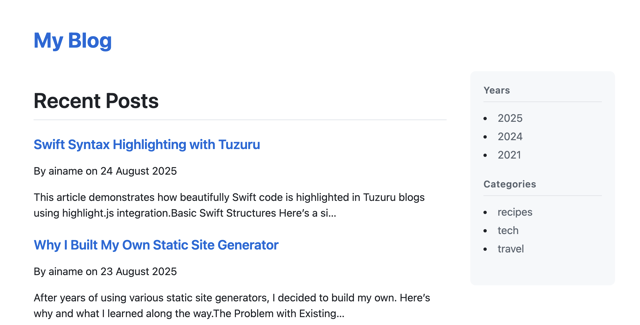

# Tuzuru

Tuzuru (綴る) is dead-simple static **blog** generator CLI written in Swift. It's similar to static site generators but focuses on simple blog.

In Tuzuru, Git is the way to manage metadata. You just write **plain** markdown and save them to Git.
Tuzuru will get published date and author info for each post from Git. You don't need to remember "YAML front matter" syntax/rules.

## Motivation

I've built a blog with Hugo a few years ago and then stopped updating it at some point.
When I wanted to restart recently, it was tough for me to remember/re-learn how to use Hugo.

I really wanted to use a simple and intuitive blogging tool.
I tried some but none of them convinced me. I ended up creating my own.

Tuzuru aims for the following policy

* Plain markdown (No YAML front matter)
* Simple routing that suits blogs
* No JavaScript framework

## Installation

Right now there's no binary distribution. I'll prepare brew tap for macOS.

```bash
swift build -c release
cp .build/release/tuzuru /path/to/bin
```

## Getting started

You first need to set up a Git repo locally.

```bash
mkdir new-blog
cd new-blog
git init

# Initialize a blog project
# This adds `assets`, `contents`, `templates` directories and `tuzuru.json`
tuzuru init

git add . && git commit -m "init commit"
```

Then create a markdown file under the `contents` directory and do `git commit`.

``` bash
emacs contents/first-blog-post.md
git add contents/first-blog-post.md
git commit -m "First post"
```

When you make `git commit` becomes your post's published date.
Specifically, the first commit's Author Date for a markdown file under `contents` is the published date and also, author name will be taken from Git's config. (You can always amend the Author Date and Author on the first commit by git command)

Now it's time to build your blog.

``` bash
tuzuru generate
```

You can now see the `blog` directory that can be deployed to GitHub Pages or your favorite HTTP server.
Or you can preview it with local HTTP server like `python3 -m http.server 8000 -d blog` and open `http://localhost:8000`.

The default layout is good enough to start (hopefully). It adopted [github-markdown-css](https://github.com/sindresorhus/github-markdown-css) and [highlight.js](https://highlightjs.org/) already.



### Example project structure

```
my-blog/
├── contents/
│   ├── hello-world.md          # → /hello-world
│   ├── tech/
│   │   └── swift-tips.md       # → /tech/swift-tips (listed on /tech)
│   └── unlisted/
│       └── about.md            # → /about (not listed anywhere. You can link to /about from layout.mustache manually)
├── templates/
│   ├── layout.mustache
│   ├── post.mustache
│   └── list.mustache
├── assets/
│   └── main.css
└── tuzuru.json
```

## How it works

### Layout and customization

Tuzuru supports two types of pages.

1. Post - a blog article
2. List - a listing page generated automatically

You can customize those page layouts in three files written with Mustache.

* templates/layout.mustache - Base layout
* templates/post.mustache - main part of post page
* templates/list.mustache - main part of list page

Read this page about Mustache syntax.
https://docs.hummingbird.codes/2.0/documentation/hummingbird/mustachesyntax/

### Listing pages and unlisted pages

By default, a markdown file under `contents` will be listed on the following pages automatically.

* Home page at `/` depending on your configuration
* Yearly archive pages - pages grouped by year on published date at `/2025`, `/2024`, etc..
* Category pages - when you put a markdown file in a directory under `contents`; e.g. `contents/tech/swift.md` will be listed on `/tech`

You can also add a markdown as an unlisted page by adding it to `contents/unlisted/`. In that case, such a markdown file won't be listed on any pages automatically. Instead, you can link it from the template file manually.

### Assets

`tuzuru init` creates an `assets` directory that contains `main.css`.
Any files under the `assets` directory will be copied to `blog/assets` by `tuzuru generate`.

To avoid browser cache issues for assets (cache busting), you can use the `{{buildVersion}}` variable in your template like below.

```mustache
<link rel="stylesheet" href="{{assetsUrl}}main.css?{{buildVersion}}">
```

### tuzuru.json

tuzuru.json is the main configuration file.
You can actually omit most of it if you just use default values.

```javascript
{
  // "metadata" is the mandatory setting and others can be removed
  "metadata" : {
    "blogName" : "My Blog",
    "copyright" : "My Blog",
    "locale" : "en_GB" // This will affect the published date's format
  },
  // "output" to configure output options
  "output" : {
    // the artifact directory
    "directory" : "blog",
    // "all", "currentYear", or a number in string (last X posts)
    "homePageStyle" : "all",
    // "subdirectory" or "direct"; "subdirectory" routes "contents/hello-world.md" to "/hello-world",
    // whilst "direct" routes it to "/hello-world.html"
    "routingStyle" : "subdirectory"
  },
  // "sourceLayout" to customize directory structures from the default values but you typically don't need to do this
  "sourceLayout" : {
    "assets" : "assets",
    "contents" : "contents",
    "imported" : "contents/imported",
    "templates" : {
      "layout" : "templates/layout.mustache",
      "list" : "templates/list.mustache",
      "post" : "templates/post.mustache"
    },
    "unlisted" : "contents/unlisted"
  }
}
```

## Import posts from Hugo project

You can import markdown files from a Hugo project. YAML front matter will be parsed to grab title, author and published date when available, and then it will be removed. Each markdown file will appear in an individual git commit.

```bash
tuzuru import /path/to/import-target-dir # import them to ./contents/imported by default
tuzuru import /path/to/import-target-dir --destination /path/to/import
```

## Build Requirements

- Swift 6.2+
- macOS v26+
